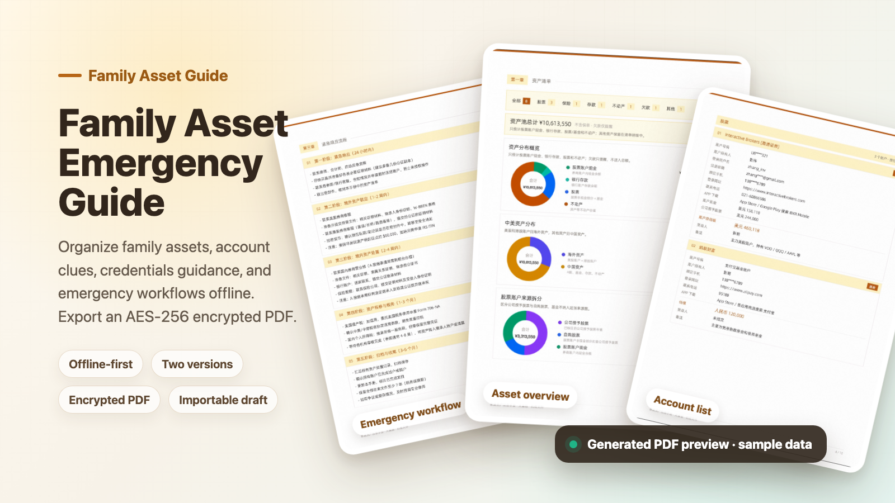
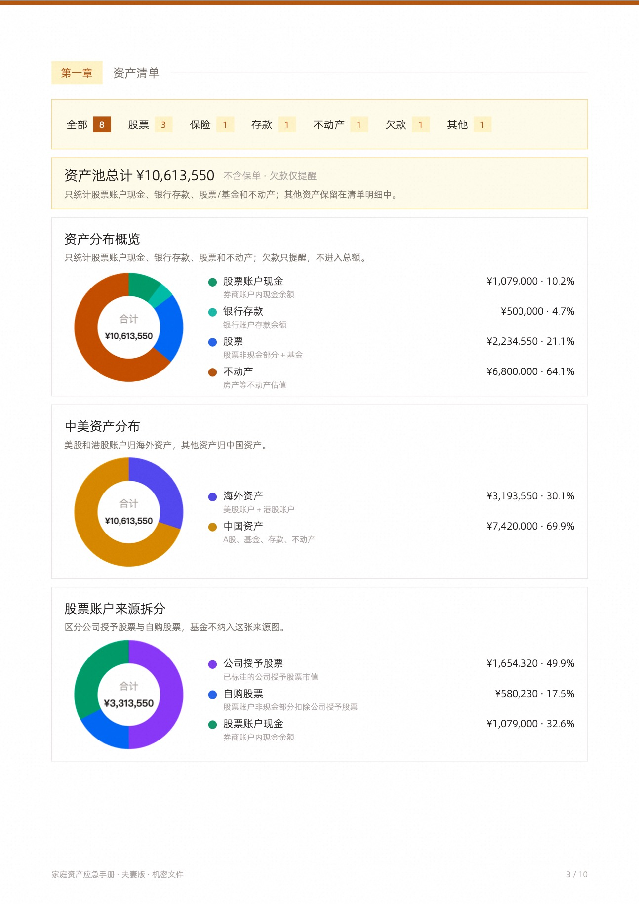
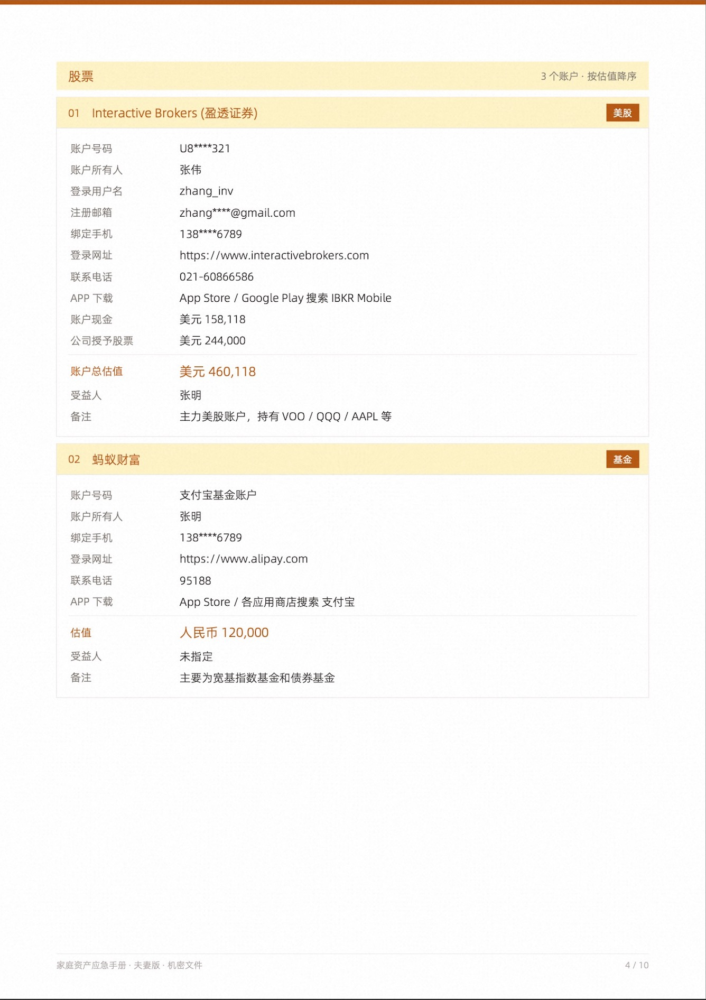
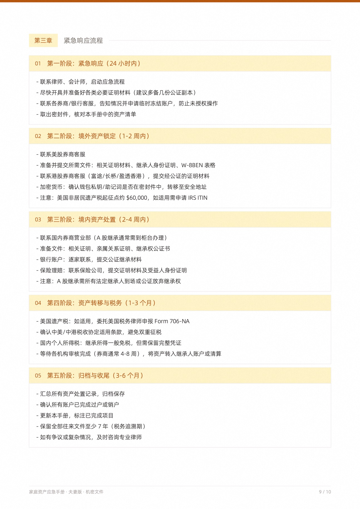

# Family Asset Emergency Guide

English | [简体中文](README.md)



An offline-first tool for creating a family asset emergency guide. It helps you organize asset records, account clues, credential guidance, and emergency workflows into a PDF that family members can find, understand, and act on when it matters.

**Use online:** https://tomczhang.github.io/family-asset-guide/

## Why This Exists

Family assets are rarely kept in one place. Brokerage accounts, funds, bank deposits, insurance policies, real estate, overseas accounts, crypto wallets, debts, password managers, 2FA devices, and key contacts are often scattered across apps, people, and memory.

This guide is built around one practical question:

> If someone in the family suddenly needs to take over, will they know what assets exist, where to look, who to contact, and what to do next?

## What It Generates

One set of data can be exported into two PDF versions, so you can share the right level of detail with the right person.

| Version | Intended reader | Included | Hidden |
| --- | --- | --- | --- |
| **Full version** | Spouse / trusted co-decision maker | Asset values, login clues, credential guidance, emergency workflow, importable draft | Nothing |
| **Relative version** | Close family member | Asset categories, institutions, account clues, contacts, notes, emergency workflow, importable redacted draft | Values, login credentials, password guidance, full draft |

The core idea is to separate "knowing what exists" from "being able to log in and move assets." The relative version provides a map; the full version supports complete handoff.

## Output Preview

<table>
  <tr>
    <td width="33%" align="center">
      
      <br />
      <strong>Asset overview</strong>
    </td>
    <td width="33%" align="center">
      
      <br />
      <strong>Account list</strong>
    </td>
    <td width="33%" align="center">
      
      <br />
      <strong>Emergency workflow</strong>
    </td>
  </tr>
</table>

The screenshots use sample data. The generated PDF is automatically laid out from the assets, contacts, workflows, and custom notes you enter.

## Highlights

- **Offline-first**: data stays in the current browser page and is not uploaded to a server
- **AES-256 encrypted PDF**: the full version is password protected
- **PDF as archive**: the full edition embeds the complete draft, while the relatives edition embeds a redacted draft; both can be imported again with the password
- **Two export versions**: generate a complete version and a redacted family version from the same data
- **Asset classification**: supports stocks, funds, bank deposits, insurance, real estate, crypto assets, debts, and more
- **Institution presets**: includes common financial institution URLs, support phone numbers, and app download clues
- **Emergency SOP**: starts with a five-stage emergency workflow that can be customized
- **Custom sections**: add will notes, lawyer contacts, trust information, family instructions, or other important context

## Workflow

1. Select or add institutions, then fill in account details, owners, contacts, values, and notes.
2. Add password storage locations, 2FA recovery methods, contacts, and emergency instructions.
3. Preview and export the full or relative PDF.
4. Store the encrypted PDF, printed copy, and unlock password separately, then update the guide regularly.

## Security Boundaries

- Unsaved data is lost when the page closes, so export a draft or PDF in time
- JSON drafts are not encrypted and should only be stored in a secure location
- The full PDF contains sensitive information, so use a strong password and share it carefully
- The relative PDF hides values, credentials, and password guidance, but still contains asset clues
- This is an information organization tool, not a substitute for legal, tax, inheritance, or estate planning advice

## Tech Stack

- **Frontend**: React 18 + TypeScript + Vite
- **PDF generation**: @cantoo/pdf-lib with Chinese font embedding and AES-256 encryption
- **Charts**: Canvas donut charts rendered to PNG and embedded into the PDF
- **Packaging**: vite-plugin-singlefile for an offline-friendly single HTML build
- **Deployment**: GitHub Pages

## Local Development

```bash
npm install
npm run dev
```

Open `http://localhost:5173` in your browser.

## Build

```bash
npm run build
```

The build output is `dist/index.html`, which can be opened offline.

## Browser Requirements

Chrome 103+ or Edge is recommended. The app relies on the `queryLocalFonts` API to read local Chinese fonts so exported PDFs render Chinese text correctly.

## License

MIT
