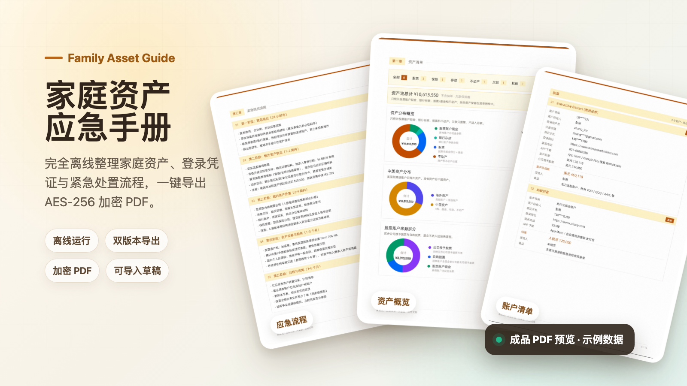

# 家庭资产应急手册

[English](README.en.md) | 简体中文



一款完全离线运行的家庭资产应急手册生成工具。它帮助你把家庭资产、账号线索、密码指引和紧急处置流程整理成一份可交给家人的 PDF：平时安全保存，关键时刻能被找到、读懂、执行。

**在线使用：** https://tomczhang.github.io/family-asset-guide/

## 为什么做它

很多家庭的资产并不只存在一张银行卡里：券商、基金、保险、不动产、海外账户、加密钱包、欠款、密码管理器、2FA 设备和联系人线索，往往分散在不同人、不同 App 和不同记忆里。

这份手册解决的是一个朴素但重要的问题：

> 如果家里突然需要接手资产，亲人是否知道有哪些资产、去哪里找、联系谁、下一步怎么做？

## 它能生成什么

从同一份资料一键导出两种版本，适合分层交付和保管。

| 版本 | 适合交给谁 | 包含内容 | 隐藏内容 |
| --- | --- | --- | --- |
| **夫妻版 full** | 配偶 / 共同决策人 | 完整资产金额、登录线索、密码指引、紧急流程、可导入草稿 | 无 |
| **亲属版 relative** | 极亲近直系亲属 | 资产种类、机构、账号线索、联系人、备注、应急流程 | 金额、登录凭证、密码指引、内嵌草稿 |

设计原则是把「知道有哪些资产」和「能实际登录处置资产」分开。亲属版用于告知线索，夫妻版用于完整交接。

## 成品预览

<table>
  <tr>
    <td width="33%" align="center">
      
      <br />
      <strong>资产概览</strong>
    </td>
    <td width="33%" align="center">
      
      <br />
      <strong>账户清单</strong>
    </td>
    <td width="33%" align="center">
      
      <br />
      <strong>紧急响应流程</strong>
    </td>
  </tr>
</table>

以上图片均为示例数据。实际生成的 PDF 会根据你录入的资产、联系人和自定义说明自动排版。

## 核心能力

- **完全离线**：所有数据只存在于当前浏览器页面，不上传服务器
- **AES-256 加密 PDF**：夫妻版 PDF 使用密码加密，密码是唯一解锁方式
- **PDF 即存档**：夫妻版加密 PDF 内嵌完整草稿，输入密码即可重新导入继续编辑
- **双版本导出**：同一份资料生成完整版本和脱敏版本，便于分别交付
- **资产自动归类**：支持股票、基金、银行存款、保险、不动产、加密资产、欠款等
- **机构预设**：内置常见金融机构的网址、客服电话、App 下载线索
- **应急 SOP**：预置五阶段流程，也可以按家庭情况自由改写
- **自定义章节**：补充遗嘱提示、律师信息、信托说明、重要备忘等内容

## 使用流程

1. 选择或新增资产机构，填写账号、所有人、联系方式、金额和备注。
2. 补充密码存放位置、2FA 恢复方式、联系人和紧急操作说明。
3. 预览并导出夫妻版或亲属版 PDF。
4. 将加密 PDF、纸质打印件和解锁密码分开保存，定期更新。

## 安全边界

- 关闭页面后，未导出的数据会丢失，请及时保存草稿或 PDF
- JSON 草稿不加密，请只保存在加密磁盘或可信位置
- 夫妻版 PDF 含敏感信息，请使用强密码并妥善分发
- 亲属版不含金额、登录凭证和密码指引，但仍包含资产线索，也应谨慎保存
- 这是一款信息整理工具，不替代遗嘱、信托、税务、继承或法律咨询

## 技术栈

- **前端**：React 18 + TypeScript + Vite
- **PDF 生成**：@cantoo/pdf-lib，支持中文字体嵌入和 AES-256 加密
- **图表**：Canvas 渲染环形图后嵌入 PDF
- **打包**：vite-plugin-singlefile，构建为可离线打开的单 HTML 文件
- **部署**：GitHub Pages 自动发布

## 本地开发

```bash
npm install
npm run dev
```

浏览器访问 `http://localhost:5173`。

## 构建

```bash
npm run build
```

构建产物位于 `dist/index.html`，可直接离线打开。

## 浏览器要求

推荐使用 Chrome 103+ 或 Edge。工具依赖 `queryLocalFonts` API 读取系统中文字体，以保证导出的 PDF 中文显示正常。

## License

MIT
